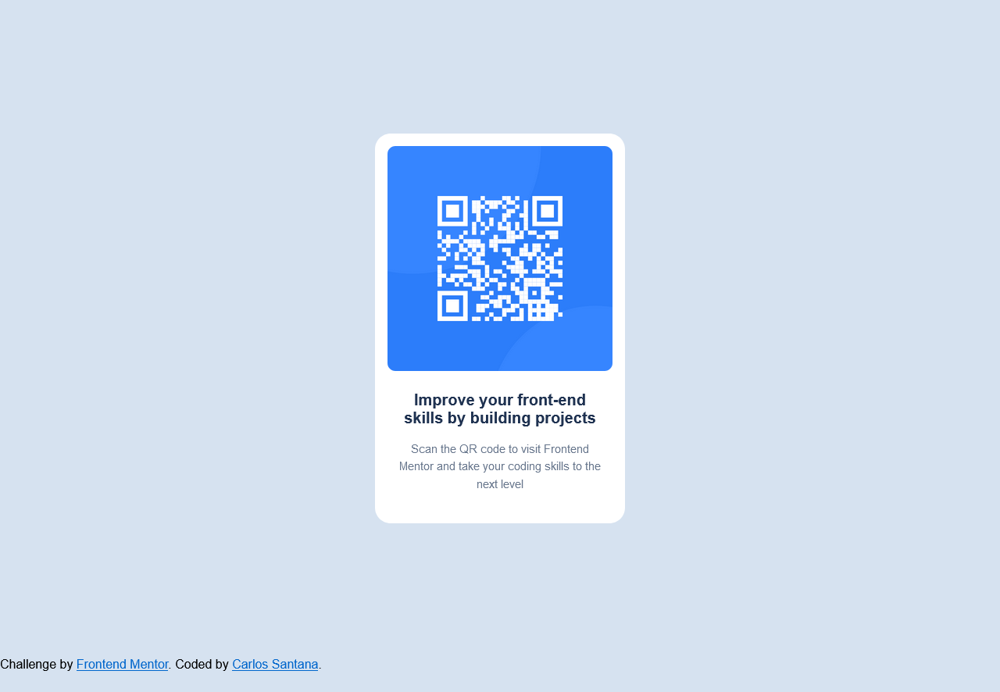

# Frontend Mentor - QR code component solution

This is a solution to the [QR code component challenge on Frontend Mentor](https://www.frontendmentor.io/challenges/qr-code-component-iux_sIO_H). Frontend Mentor challenges help you improve your coding skills by building realistic projects. 

## Table of contents

- [Overview](#overview)
  - [Screenshot](#screenshot)
  - [Links](#links)
  - [Built with](#built-with)
  - [What I learned](#what-i-learned)
  - [Continued development](#continued-development)
  - [Useful resources](#useful-resources)
- [Author](#author)
- [Acknowledgments](#acknowledgments)

**Note: Delete this note and update the table of contents based on what sections you keep.**

## Overview

### Screenshot

### Links

- Solution URL: [Add solution URL here](https://github.com/cacesasa/qr-code-component-main?tab=readme-ov-file)
- Live Site URL: [Add live site URL here](https://cacesasa.github.io/qr-code-component-main/)

### Built with

- Semantic HTML5 markup
- CSS custom properties
- CSS Grid

### What I learned

This is my first callenge and I did have a lot of fun building it. During
this challenge I realized that even a smmall challenge like this, it is not as simple as it looks.

### Continued development

I want to keep expanding my knowledge of CSS and HTML.

### Useful resources

-(https://www.w3schools.com/) - Help me with my CSS properties, specially
 with grid box.

## Author

- Frontend Mentor - [@cacesasa](https://www.frontendmentor.io/profile/cacesasa)
- Twitter - [@cacesasa](https://www.twitter.com/cacesasa)

## Acknowledgments

